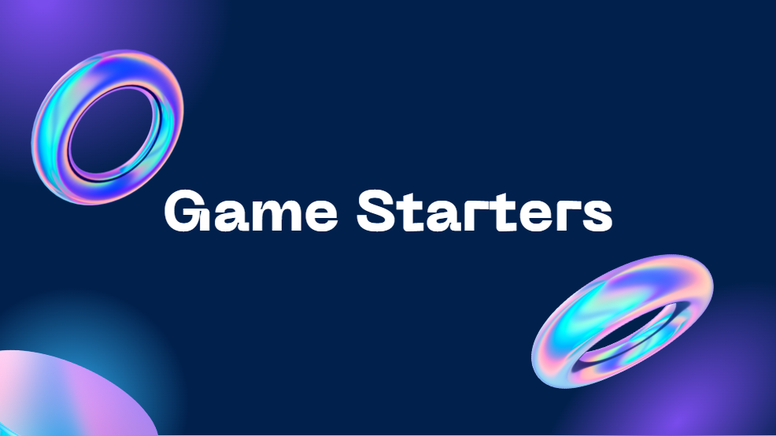
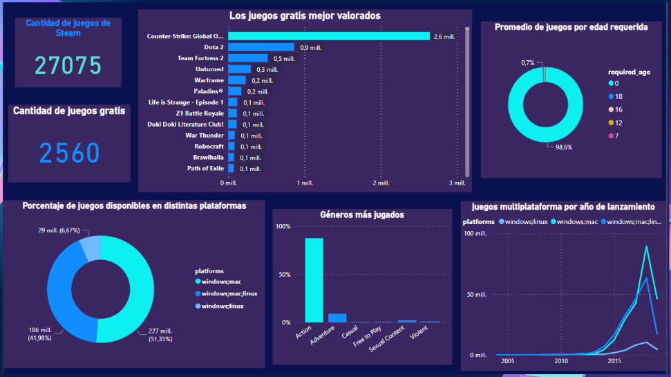

# GameStarters
Proyecto creado en ámbito de estudio de la materia Data Analytics y utilización de Power BI.

## Tabla de Contenido
1. [Información general](#general-info)
2. [Tecnologías](#technologies)
3. [Storytelling de la presentación del trabajo realizado](#subject)

## Información general
***
Proyecto abordado utilizando Power BI. 
Partimos de una base de datos llamada STEAM con información relevate sobre videojuegos. Aplicamos transformaciones a dicha tabla para tener los datos necesarios de forma normalizada y proceder luego a relizar gráficos de nuestro interés para poder abordar la problemática llevada a cabo en clases y obtener información relevante, logrando un aprendizaje valioso. 

## Tecnologías
***
- Power BI, para realizar transformación y visualización de datos. 
- Presentación realizada en Canva, para dar a conocer de forma ordenada, sencilla y dinámica la problemática abordada y la información obtenida.

## Storytelling de la presentación del trabajo realizado
***
### Screenshot

- Somos GAME STARTERS, una **comunidad de gamers que busca facilitar el proceso de inserción al mundo de los videojuegos para aquellas personas que nunca hayan jugado de forma online en su vida**.

- ¿PORQUE? **En pleno siglo XXI, el ritmo vertiginoso con el que ocurren los avances en el mundo de los videojuegos puede resultar abrumador para quienes se aventuran por primera vez en el.** La abundancia de juegos disponibles es increíble, pero **¿por dónde podes comenzar si nunca jugaste antes?**

- ¿QUÉ BUSCAMOS? **dar respuesta a estas preguntas:**
    ¿Qué juego quiero jugar?
    ¿Qué género me gusta?
    ¿Es compatible este juego con mi PC?
    ¿Qué costo tiene?
    ¿Cuantos niveles voy a jugar?
    ¿Vale la pena este juego?

**para que el ingreso al mundo de los videojuegos además de ser una muy buena experiencia, sea la mejor decisión**.
    
- PARA DAR UN CONTEXTO: **Según Sentinel Report, en el año 2021 había alrededor de 3.240 millones de gamers en todo el mundo**. **Solamente en Argentina ya había más de 19 millones, es decir aproximadamente un 42% del total de sus habitantes (**Según la Asociación de Deportes Electrónicos y Electromecánicos de Argentina)

- Con eso en mente, nuestro objetivo es **Incentivar a nivel mundial, la inserción de 324 millones de nuevos jugadores sin experiencia previa en 1 año**. Esto parece muy ambicioso pero **se trata simplemente de elevar la cantidad de miembros de esta comunidad en un 10%**
    
- PARA MEDIR NUESTRO OBJETIVO DESARROLLAMOS 3 RESULTADOS CLAVE:
    - Aumentar la cantidad de jugadores nuevos de la comunidad gamer en un 5% en el plazo de 4 meses.
    - Aumentar la cantidad de jugadores en un 10% en los juegos gratis en 6 meses.
    - Aumentar la cantidad de jugadores en un 10% en los juegos mejor valorados en 10 meses.
    
- DICHO ESTO,  **DE NUESTRO SEGUNDO RESULTADO CLAVE,** parte el INDICADOR CLAVE DE DESEMPEÑO (KPI) que vamos a usar de ejemplo, **¿Cómo? analizando los datos proporcionados por Steam para realizar recomendaciones de los mejores juegos:**

- DASHBOARD:
    - La base de datos de steam tiene un total de 27.075 juegos,
    - de los cuales 2560 son gratuitos. Esto lejos de ser poco, es abrumador. Imaginense, ¿qué juego de más de los 2000 que hay, elijo para comenzar? 
    - Entonces podríamos partir por un género, pero para ello, nos gustaría conocer cual es el más jugado: ACCION y en segundo lugar, AVENTURA; 
    - Pero entonces, este juego que yo elija del género acción va a estar disponible para mi maquina? si tengo sistema operativo windows?
    - SI. Generalmente los juegos se encuentran disponibles en más de una plataforma como muestra nuestro grafico y más aún a partir de los ultimos 8 años aproximadamente, en los cuales hubo un incremento en el lanzamiento de videojuegos multiplataforma. 
    - Con toda esta información podríamos pensar que la edad que tenga nuestro potencial jugador puede ser un problema pero esto no es así, ya que la mayoría de los juegos no tienen una edad determinada como requisito. 
    - Finalmente, con todo este analisis queremos saber cual es el ansiado juego que vamos a jugar si queremos ingresar a esta comunidad... así que podemos decirles que **nuestro recomendado numero 1**, y más de uno puede estar de acuerdo...**es el famosisimo y queridisimo clasico COUNTER STRIKE**, con un total increible de valoraciones positivas y al cual le siguen en el podio el DOTA 2 y TEAM FORTRESS 2.

    

- Asi que esto y mucho más es lo que podemos ofrecer a quienes quieran ingresar al mundo más divertido de todos, **QUE COMIENCE EL JUEGO y MUCHAS GRACIAS.**
